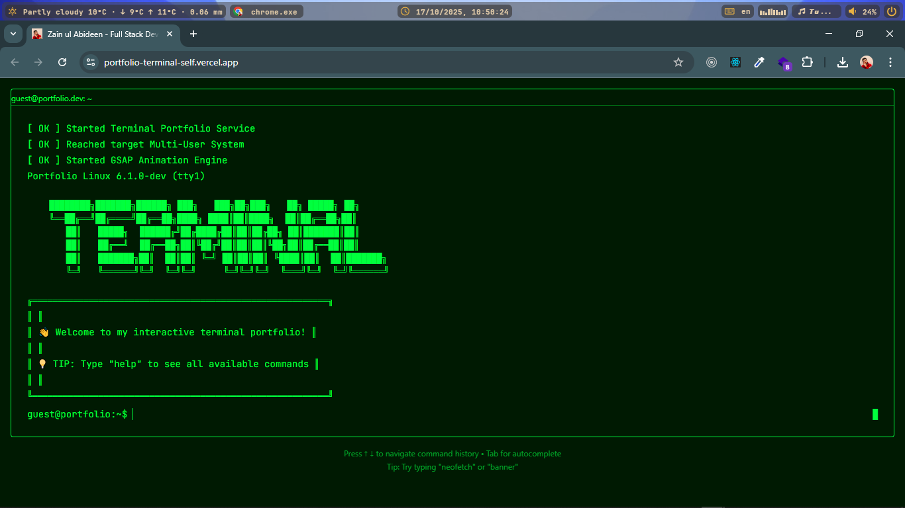
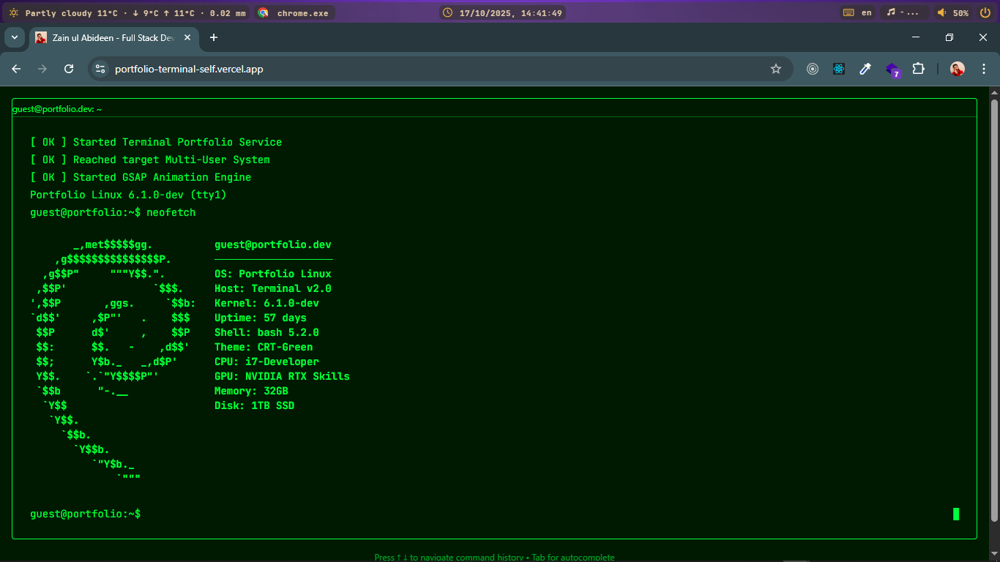
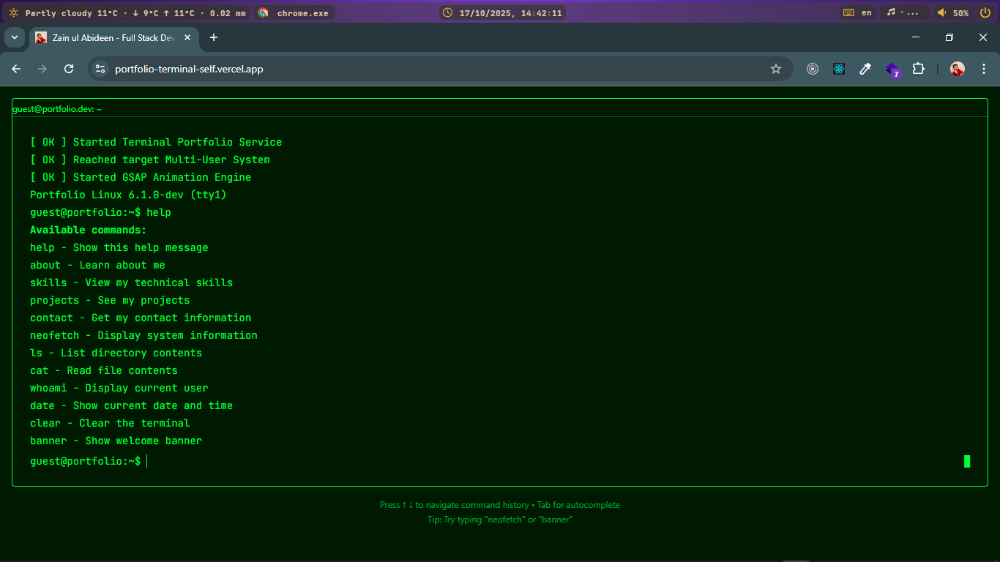
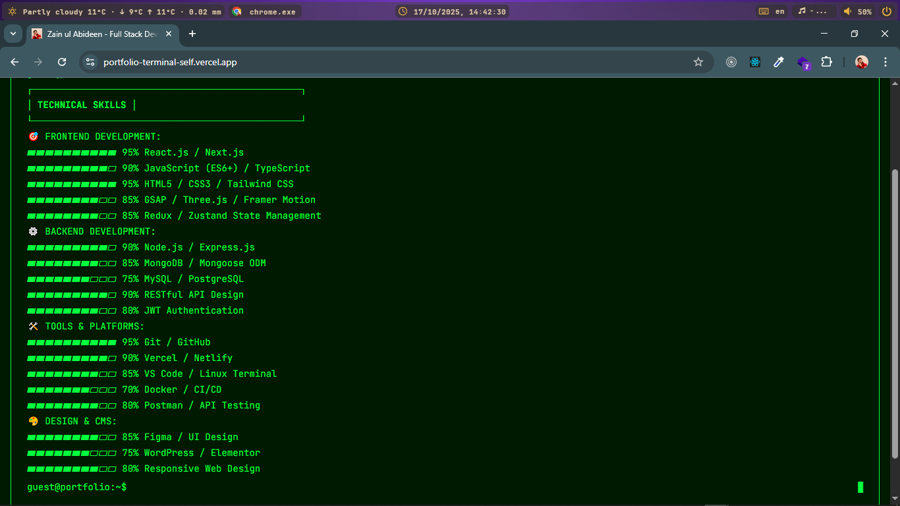
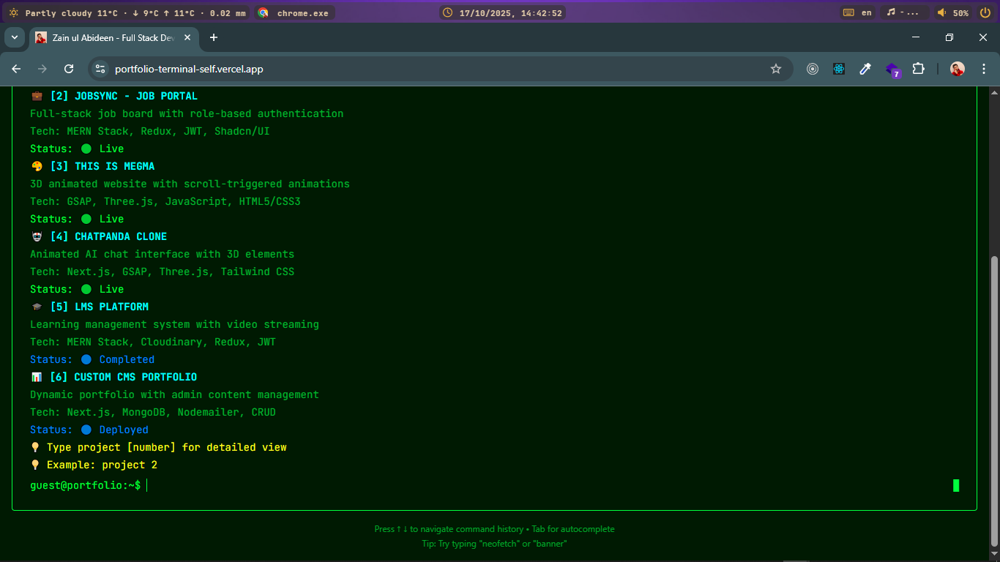

# 🖥️ Terminal Portfolio

<div align="center">

 <!-- Replace with your actual screenshot -->

**A Linux-terminal inspired developer portfolio with an interactive command-line interface**

[](https://portfolio-terminal-self.vercel.app/)
[](https://github.com/hey-Zayn/Portfolio-Terminal)
[](https://linkedin.com/in/zayn-butt)

</div>

## ✨ Features

- **🖥️ Interactive Terminal Interface** - Type commands to navigate the portfolio
- **📟 Retro CRT Aesthetics** - Authentic scanlines and terminal glow effects
- **⌨️ Real-time Command Execution** - Dynamic response to user input
- **📱 Fully Responsive** - Works perfectly on desktop, tablet, and mobile
- **🎨 Custom Themes** - Multiple terminal color schemes available
- **⚡ Built with Modern Stack** - React, Vite, TypeScript

## 🚀 Quick Start

### Prerequisites
- Node.js (v18 or higher)
- npm or yarn

### Installation

```bash
# Clone the repository
git clone https://github.com/hey-Zayn/terminal-portfolio.git

# Navigate to project directory
cd terminal-portfolio

# Install dependencies
npm install

# Start development server
npm run dev

```
🎮 Available Commands


neofetch - Show specifications
```
neofetch 
```



help - Show available commands
```
help 
```



about - Learn about me
```

about
```


skills - View my technical skills

```
skills 
```


projects - See my projects
```
projects
```


banner - Show welcome banner
```
banner 
```

contact - Get in touch
```
contact
```


clear - Clear the terminal
````
clear
````

theme [name] - Change terminal theme

